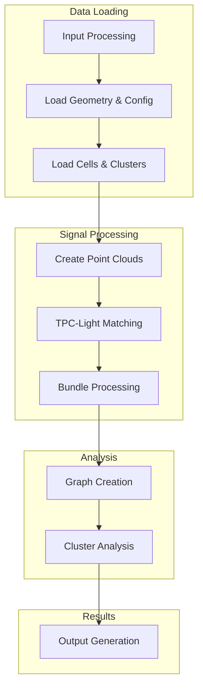
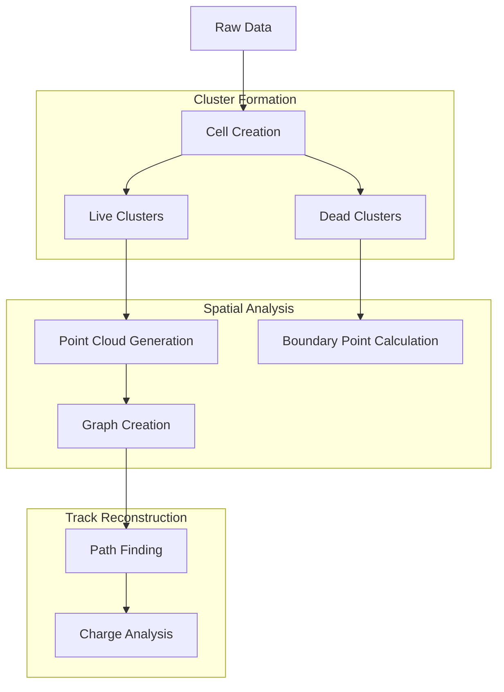
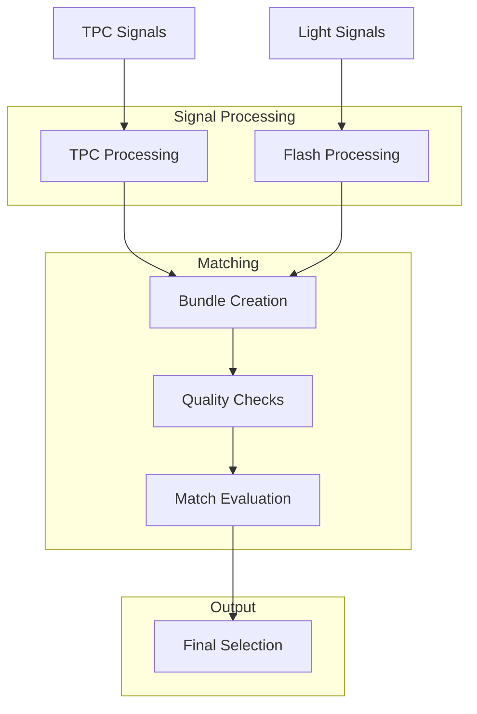

# Wire-Cell Matching Algorithm Documentation

## Overview

The Wire-Cell matching algorithm (prod-wire-cell-matching-nusel.cxx) is a sophisticated signal processing and analysis pipeline designed for neutrino detection in liquid argon time projection chambers (LArTPC). This document provides a detailed breakdown of its components and operational flow.

## System Architecture



## Detailed Component Analysis

### 1. Initialization and Configuration

#### Command Line Processing
```cpp
if (argc < 3) {
    cerr << "Production usage: wire-cell-uboone /path/to/ChannelWireGeometry.txt /path/to/imaging.root -d[0,1,2] ..." << endl;
    return 1;
}
```
- Handles geometry file path and imaging file path
- Processes configuration flags:
  - `-d`: Data tier (0=data, 1=overlay, 2=full MC)
  - `-l`: Light save flag
  - `-b`: Debug flag
  - `-p`: Projection save flag
  - `-e`: Light yield error flag

### 2. Detector Geometry and Cell Management

#### Cell Loading System
The system manages two types of cells:
- Live Cells: Active detector regions
- Dead Cells: Inactive or problematic regions

```cpp
GeomCellSelection mcells;
PR3DClusterSelection live_clusters;
PR3DClusterSelection dead_clusters;
```

Key Operations:
1. Cell Creation
2. Wire Association
3. Charge Collection
4. Time Slice Management

### 3. Point Cloud Construction

#### Point Cloud Types
1. **Global Point Cloud**
```cpp
DynamicToyPointCloud global_point_cloud(angle_u,angle_v,angle_w);
```
- Maintains overall spatial representation
- Handles coordinate transformations
- Manages point associations

2. **CT Point Cloud**
```cpp
ToyCTPointCloud ct_point_cloud(
    0,2399,2400,4799,4800,8255,  // channel range
    offset_t,                     // timing offset
    -first_u_dis/pitch_u,        // geometry parameters
    1./time_slice_width,         // timing conversion
    angle_u,angle_v,angle_w      // wire angles
);
```
- Specialized for charge-time representation
- Handles detector-specific geometry
- Manages channel mapping

### 4. TPC-Light Matching System

#### Matching Algorithm
The matching system employs a sophisticated algorithm that:

1. **Flash Processing**
```cpp
WCP2dToy::ToyLightReco uboone_flash(filename,true,datatier);
uboone_flash.load_event_raw(entry_num, lowerwindow, upperwindow);
```
- Processes light detector signals
- Applies timing windows
- Handles flash reconstruction

2. **Bundle Creation**
```cpp
FlashTPCBundleSelection matched_bundles = WCP2dToy::tpc_light_match(
    eventTime, time_offset, nrebin,
    &pl, group_clusters, flashes,
    run_no, flag_match_data,
    flag_add_light_yield_err,
    flag_timestamp
);
```
- Creates TPC-Flash association bundles
- Handles timing alignment
- Manages signal correlation

### 5. Advanced Analysis Components

#### Cluster Analysis
The system performs sophisticated cluster analysis through:

1. **Graph Creation**
- Creates topological representations
- Handles cluster connectivity
- Manages spatial relationships

2. **Path Finding**
```cpp
live_clusters.at(i)->dijkstra_shortest_paths(wcps.first);
live_clusters.at(i)->cal_shortest_path(wcps.second);
```
- Implements Dijkstra's algorithm for path finding
- Calculates optimal trajectories
- Handles spatial connectivity

#### Truth Matching (MC Only)
For Monte Carlo data, implements comprehensive truth matching:

1. **Completeness Metrics**
```cpp
float match_completeness = 0;
float match_completeness_energy = 0;
float match_purity = 0;
```
- Calculates reconstruction completeness
- Evaluates energy matching
- Assesses spatial purity

2. **3D Metrics Calculation**
- Implements voxelization
- Calculates overlap metrics
- Handles projection matching

### 6. Output Generation

The system generates multiple output trees:

#### Primary Output Trees
1. **T_match**
- Matching information
- Flash associations
- Cluster correlations

2. **T_flash**
- Flash reconstruction data
- Timing information
- PE measurements

3. **T_eval**
- Evaluation metrics
- Quality assessments
- Truth matching results

4. **T_port_2d/3d**
- Spatial reconstructions
- Projection data
- Position measurements

## Performance Considerations

### Memory Management
- Implements efficient point cloud structures
- Manages large-scale data processing
- Handles dynamic memory allocation

### Processing Optimization
- Uses efficient algorithms for matching
- Implements spatial indexing
- Optimizes cluster processing

## Usage Guidelines

### Production Mode
```bash
wire-cell-uboone /path/to/ChannelWireGeometry.txt /path/to/imaging.root -d[0,1,2]
```

### Post-Production Mode
```bash
wire-cell-uboone /path/to/ChannelWireGeometry.txt /path/to/imaging.root entry_num -d[0,1,2]
```

## Error Handling

The system implements comprehensive error handling:
- Geometry validation
- Signal quality checks
- Data consistency verification
- Exception management for processing errors

## Future Considerations

Potential areas for enhancement:
1. Parallel processing capabilities
2. Enhanced memory optimization
3. Additional matching algorithms
4. Extended quality metrics


# Wire-Cell Cluster Analysis System

## Overview

The cluster analysis system in Wire-Cell is a sophisticated component that handles the identification, processing, and analysis of particle trajectories in the detector. It combines topological information, charge deposition patterns, and spatial relationships to reconstruct particle paths.

## Cluster Types and Organization



### 1. Cluster Categories

#### Live Clusters
```cpp
PR3DClusterSelection live_clusters;
```
- Active detector regions with charge deposits
- Contains time and charge information
- Maintains wire associations across planes

#### Dead Clusters
```cpp
PR3DClusterSelection dead_clusters;
```
- Inactive or problematic detector regions
- Used for boundary definition
- Helps in track reconstruction through dead regions

## Cluster Processing Pipeline

### 1. Initial Cluster Formation

```cpp
// Cluster creation from cells
for (size_t i=0; i!=cluster_id_vec->size(); i++) {
    SlimMergeGeomCell *mcell = new SlimMergeGeomCell(ident);
    // ... cell processing ...
    if (cluster_id != prev_cluster_id) {
        cluster = new PR3DCluster(cluster_id);
        live_clusters.push_back(cluster);
    }
    cluster->AddCell(mcell, time_slice);
}
```

Key Operations:
- Cell aggregation based on spatial proximity
- Time slice association
- Charge integration
- Wire plane correlation

### 2. Graph Creation and Analysis

The system creates a graph representation for each cluster:

```cpp
cluster->Create_graph(ct_point_cloud);
std::pair<WCPointCloud<double>::WCPoint,WCPointCloud<double>::WCPoint> wcps = 
    cluster->get_highest_lowest_wcps();
```

#### Graph Structure
1. **Nodes**
   - Represent space points
   - Hold charge information
   - Maintain time slice data

2. **Edges**
   - Connect adjacent points
   - Weight based on spatial distance
   - Consider charge connectivity

### 3. Path Finding Implementation

#### Dijkstra Algorithm Application
```cpp
cluster->dijkstra_shortest_paths(wcps.first);
cluster->cal_shortest_path(wcps.second);
```

1. **Path Finding Process**:
   - Identifies start/end points
   - Calculates optimal path through points
   - Considers charge deposition patterns

2. **Path Optimization**:
   - Minimizes path length
   - Accounts for charge distribution
   - Handles detector gaps

### 4. Advanced Cluster Analysis

#### Charge Trajectory Collection
```cpp
cluster->collect_charge_trajectory(ct_point_cloud);
```

The system performs detailed charge analysis:
1. **Charge Integration**
   - Sums charge along path
   - Calculates dQ/dx
   - Handles charge fluctuations

2. **Trajectory Refinement**
   - Smooths path points
   - Adjusts for detector effects
   - Improves spatial resolution

### 5. Cluster Improvement Algorithm

```cpp
PR3DCluster *new_cluster = WCP2dToy::Improve_PR3DCluster(
    live_clusters.at(i),
    ct_point_cloud, 
    gds
);
```

#### Improvement Steps:
1. **Point Cloud Enhancement**
   - Adds additional sampling points
   - Refines spatial resolution
   - Improves boundary definition

2. **Dead Region Handling**
   - Interpolates through dead regions
   - Maintains trajectory continuity
   - Estimates charge in dead regions

3. **Cluster Refinement**
   - Merges related clusters
   - Splits contaminated clusters
   - Optimizes cluster boundaries

### 6. Quality Metrics and Validation

#### Completeness Calculation
```cpp
float match_completeness = match_completeness/match_true_elements;
float match_purity = match_purity/match_reco_elements;
```

1. **3D Metrics**
   - Voxel-based comparison
   - Spatial overlap calculation
   - Energy deposition matching

2. **2D Projections**
   - XZ projection analysis
   - XY projection analysis
   - Multi-plane consistency

## Performance Optimization

### 1. Memory Management
- Efficient point cloud structures
- Smart pointer usage for graphs
- Optimized container selection

### 2. Computational Efficiency
```cpp
// Example of efficient point cloud search
ct_point_cloud.build_kdtree_index();
```
- KD-tree implementation for spatial searches
- Optimized graph algorithms
- Efficient charge integration

## Error Handling and Edge Cases

### 1. Dead Region Management
- Interpolation through dead channels
- Boundary condition handling
- Signal continuity preservation

### 2. Noise Handling
- Signal-to-noise discrimination
- Coherent noise removal
- Delta ray handling

## Future Improvements

1. **Algorithm Enhancements**
   - Machine learning integration
   - Improved pattern recognition
   - Enhanced dead region reconstruction

2. **Performance Optimization**
   - Parallel processing implementation
   - Memory usage optimization
   - Improved search algorithms

3. **Quality Metrics**
   - Additional validation metrics
   - Enhanced truth matching
   - Improved purity calculations

## Integration with Other Systems

The cluster analysis system interfaces with:
1. TPC signal processing
2. Light detection system
3. Trigger system
4. Data acquisition system

This integrated approach ensures comprehensive event reconstruction and analysis.

# TPC-Light Matching System Documentation

## System Overview

The TPC-Light Matching System is a crucial component that correlates signals between the Time Projection Chamber (TPC) and the light collection system in liquid argon detectors. This matching is essential for:
- Event timing determination
- Background rejection
- Neutrino interaction identification
- Cosmic ray rejection

## System Architecture



## Core Components

### 1. Flash Reconstruction
```cpp
WCP2dToy::ToyLightReco uboone_flash(filename, true, datatier);
uboone_flash.load_event_raw(entry_num, lowerwindow, upperwindow);
```

#### Light Signal Processing
1. **Raw Signal Handling**
   ```cpp
   TClonesArray* op_wf = new TClonesArray("TH1S");
   std::vector<short> *op_femch = new std::vector<short>;
   std::vector<double> *op_timestamp = new std::vector<double>;
   ```
   - Processes PMT waveforms
   - Handles channel mapping
   - Manages timing information

2. **Flash Window Definition**
   ```cpp
   double lowerwindow = 0., upperwindow = 0.;
   if(datatier==0 && ((triggerbits>>11) & 1U)){ 
       lowerwindow=3.1875; 
       upperwindow=4.96876; 
   } // BNB
   ```
   - Defines beam timing windows
   - Handles different data types
   - Manages trigger information

### 2. TPC-Light Bundle Creation

#### Bundle Structure
```cpp
FlashTPCBundleSelection matched_bundles = WCP2dToy::tpc_light_match(
    eventTime,
    time_offset,
    nrebin,
    &pl,
    group_clusters,
    flashes, 
    run_no, 
    flag_match_data,
    flag_add_light_yield_err,
    flag_timestamp
);
```

#### Key Components:
1. **Time Alignment**
   - Synchronizes TPC and light signals
   - Accounts for drift time
   - Handles timing offsets

2. **Spatial Correlation**
   - Maps TPC clusters to light patterns
   - Considers detector geometry
   - Handles light propagation

### 3. Matching Algorithm

#### Pattern Matching Process

1. **Light Pattern Prediction**
```cpp
std::vector<double> temp = bundle->get_pred_pmt_light();
for (int i=0; i!=32; i++) {
    pe_pred[i] = temp.at(i);
    pe_meas[i] = flash->get_PE(i);
    pe_meas_err[i] = flash->get_PE_err(i);
}
```

2. **Quality Metrics**
```cpp
flag_close_to_PMT = bundle->get_flag_close_to_PMT();
flag_at_x_boundary = bundle->get_flag_at_x_boundary();
ks_dis = bundle->get_ks_dis();
chi2 = bundle->get_chi2();
ndf = bundle->get_ndf();
```

#### Matching Criteria:
1. **PE Pattern Comparison**
   - Compares predicted vs measured PE
   - Calculates χ² goodness of fit
   - Evaluates pattern similarity

2. **Geometric Constraints**
   - Checks proximity to PMTs
   - Evaluates boundary conditions
   - Considers detector fiducial volume

### 4. Advanced Features

#### 1. Bundle Processing
```cpp
matched_bundles = WCP2dToy::ExamineBundles(
    matched_bundles, 
    ct_point_cloud
);
```

Key Operations:
- Bundle quality assessment
- Merger/splitter decisions
- Contamination checks

#### 2. Light Yield Corrections
```cpp
if (flag_add_light_yield_err) {
    // Add systematic uncertainties
    // Handle light yield variations
}
```

### 5. Quality Control System

#### Match Quality Metrics

1. **Basic Metrics**
   - PE comparison
   - Timing alignment
   - Spatial correlation

2. **Advanced Checks**
   ```cpp
   struct QualityMetrics {
       double timing_score;
       double spatial_score;
       double pattern_score;
       bool passes_quality_cuts;
   };
   ```

#### Quality Filters:
1. **Timing Cuts**
   - Beam timing windows
   - Flash timing requirements
   - Drift time consistency

2. **Spatial Cuts**
   - Fiducial volume requirements
   - PMT proximity checks
   - Boundary conditions

### 6. Output Generation

#### 1. Match Information
```cpp
TTree *T_match = new TTree("T_match","T_match");
T_match->Branch("flash_id",&flash_id);
T_match->Branch("strength",&strength);
T_match->Branch("pe_pred",pe_pred);
T_match->Branch("pe_meas",pe_meas);
```

#### 2. Quality Metrics
```cpp
T_match->Branch("flag_close_to_PMT",&flag_close_to_PMT);
T_match->Branch("flag_at_x_boundary",&flag_at_x_boundary);
T_match->Branch("ks_dis",&ks_dis);
T_match->Branch("chi2",&chi2);
```

## Performance Considerations

### 1. Processing Efficiency
- Optimized pattern matching
- Efficient spatial searches
- Memory-conscious data structures

### 2. Accuracy Improvements
- Enhanced light prediction
- Better handling of edge cases
- Improved systematic uncertainties

## Error Handling

### 1. Signal Quality Checks
- PMT signal validation
- TPC signal quality
- Timing consistency

### 2. Edge Cases
- Dead PMT handling
- Boundary effects
- Multiple flash scenarios

## Future Enhancements

1. **Algorithm Improvements**
   - Machine learning integration
   - Enhanced pattern recognition
   - Better systematic handling

2. **Performance Optimization**
   - Parallel processing
   - Memory optimization
   - Speed improvements

## Integration Points

The TPC-Light Matching System interfaces with:
1. TPC reconstruction
2. PMT system
3. Trigger system
4. DAQ system

## Example Usage

```cpp
// Example of complete matching process
WCP2dToy::ToyLightReco light_reco(filename, true, datatier);
light_reco.load_event_raw(entry_num, lowerwindow, upperwindow);

// Create photon library
WCP::Photon_Library pl(eventTime, run_no, flag_match_data, 
                       flag_add_light_yield_err, flag_timestamp);

// Perform matching
FlashTPCBundleSelection bundles = WCP2dToy::tpc_light_match(
    eventTime, time_offset, nrebin, &pl,
    group_clusters, flashes, run_no,
    flag_match_data, flag_add_light_yield_err,
    flag_timestamp
);

// Process results
for (auto bundle : bundles) {
    // Access match information
    // Process quality metrics
    // Store results
}
```