# Wire-Cell Neutrino Event Reconstruction Analysis

## Overview

The `wire-cell-prod-nue` program is a sophisticated neutrino event reconstruction system that processes detector data to identify and analyze neutrino interactions. The program implements complex algorithms for 3D reconstruction, particle identification, and event classification.

## Program Architecture

### Main Components:

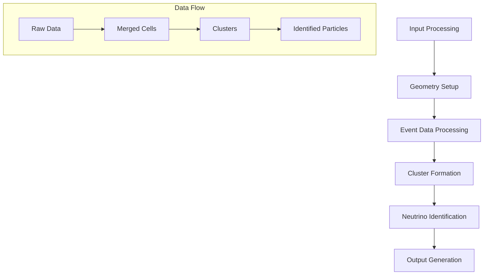

## Detailed Component Analysis

### 1. Input Processing & Configuration

#### Data Sources
- Wire geometry configuration
- Matching information
- Event data
- Calibration parameters

#### Configuration System
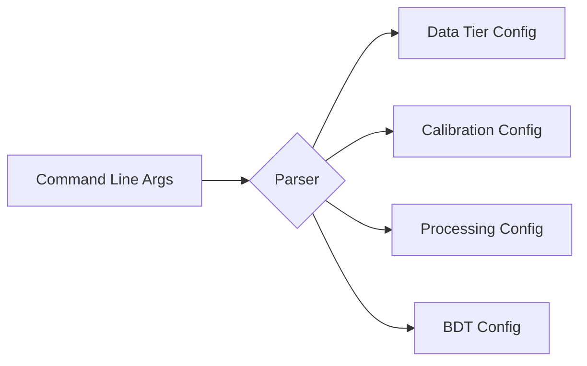

### 2. Geometry System

#### Coordinate Systems
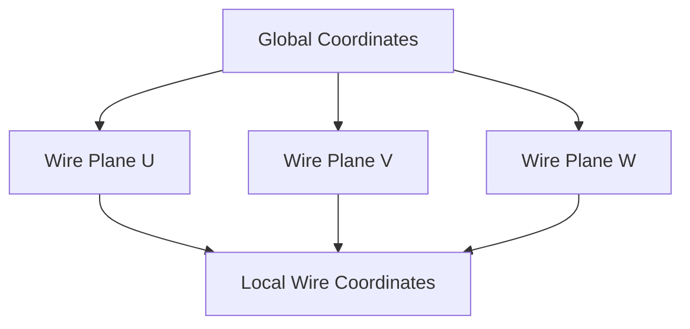

#### Wire Plane Configuration
- U plane: Vertical wires (0°)
- V plane: +60° from vertical
- W plane: -60° from vertical

### 3. Event Data Processing

#### Flash Light Detection
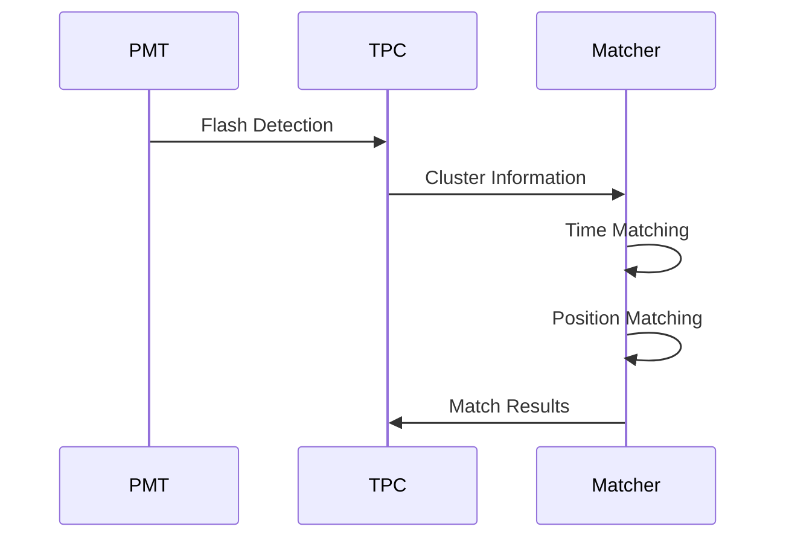

#### Charge Processing Flow
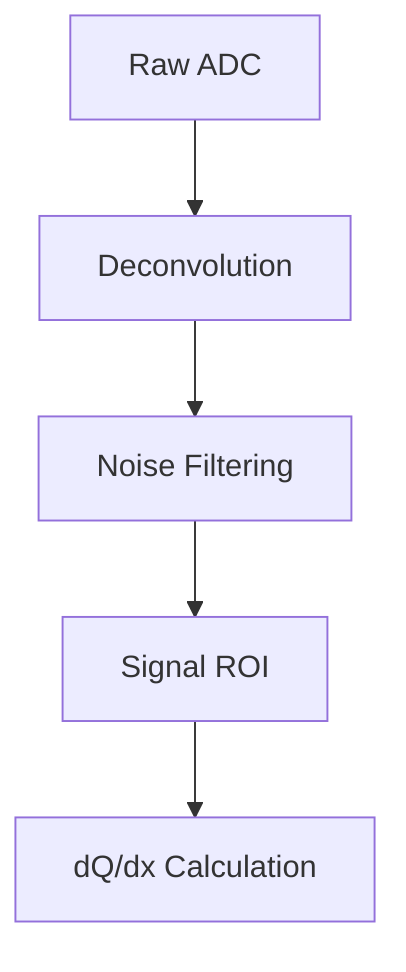

### 4. Cluster Formation System

#### Merge Cell Creation
Detailed algorithm for merging cells:

```python
def create_merge_cells():
    """
    Pseudocode for merge cell creation
    """
    for time_slice in time_slices:
        # 1. Find connected wire hits
        wire_hits = find_connected_wires(time_slice)
        
        # 2. Create initial cells
        for hit_group in wire_hits:
            if validate_3plane_intersection(hit_group):
                cell = create_merge_cell(hit_group)
                
        # 3. Calculate cell properties
        for cell in merge_cells:
            cell.calculate_charge()
            cell.establish_boundaries()
            cell.determine_bad_planes()
            
        # 4. Handle dead channels
        process_dead_channels(time_slice)
```

#### Cell Boundary Determination
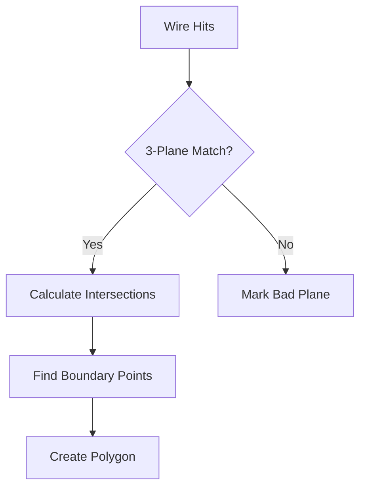

#### Cluster Formation Algorithm
Complex clustering process:

```python
def form_clusters():
    """
    Pseudocode for cluster formation
    """
    # 1. Initial clustering
    for cell in merge_cells:
        existing_cluster = find_matching_cluster(cell)
        if existing_cluster:
            existing_cluster.add_cell(cell)
        else:
            new_cluster = create_cluster(cell)
            
    # 2. Cluster relationship establishment
    for cluster in clusters:
        establish_parent_child_relations(cluster)
        calculate_cluster_properties(cluster)
        
    # 3. Point cloud creation
    for cluster in clusters:
        create_sampling_points(cluster)
        build_kdtree(cluster)
        
    # 4. Cluster refinement
    perform_cluster_splitting()
    merge_close_clusters()
    handle_track_shower_ambiguity()
```

### 5. Neutrino Identification System

#### Track/Shower Separation
Detailed decision tree:

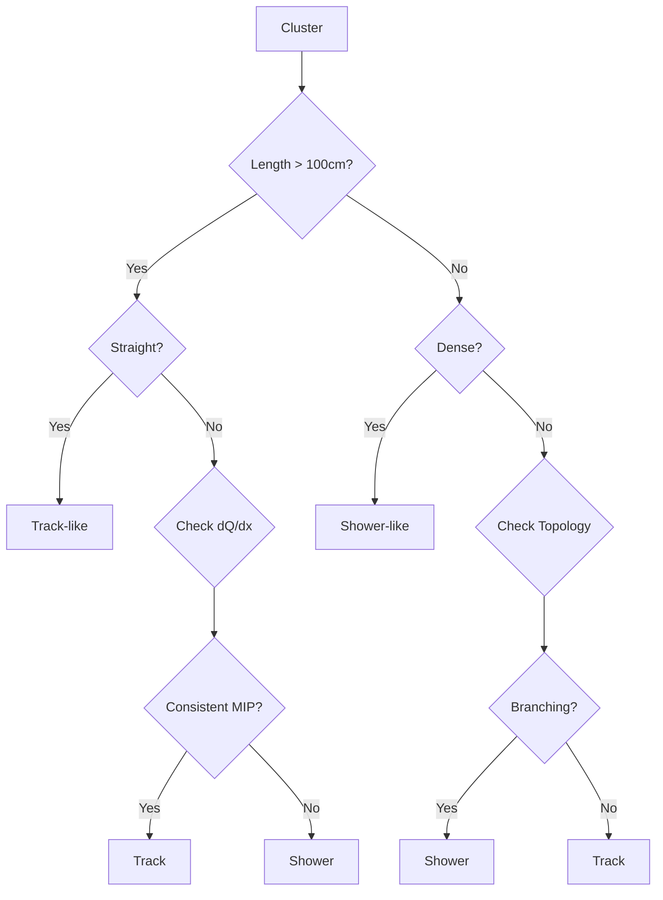

#### Particle Identification
Features used in particle identification:

1. **Track Features**:
```python
track_features = {
    'length': 'Total path length',
    'straightness': 'Deviation from line fit',
    'dQdx': 'Energy deposition profile',
    'angle': 'Direction relative to beam',
    'mip_consistency': 'Compatibility with MIP hypothesis'
}
```

2. **Shower Features**:
```python
shower_features = {
    'cone_angle': 'Opening angle of shower',
    'energy_profile': 'Longitudinal energy deposition',
    'start_dQdx': 'Energy at shower start',
    'branching': 'Degree of branching',
    'density': 'Hit density distribution'
}
```

#### Vertex Finding Algorithm
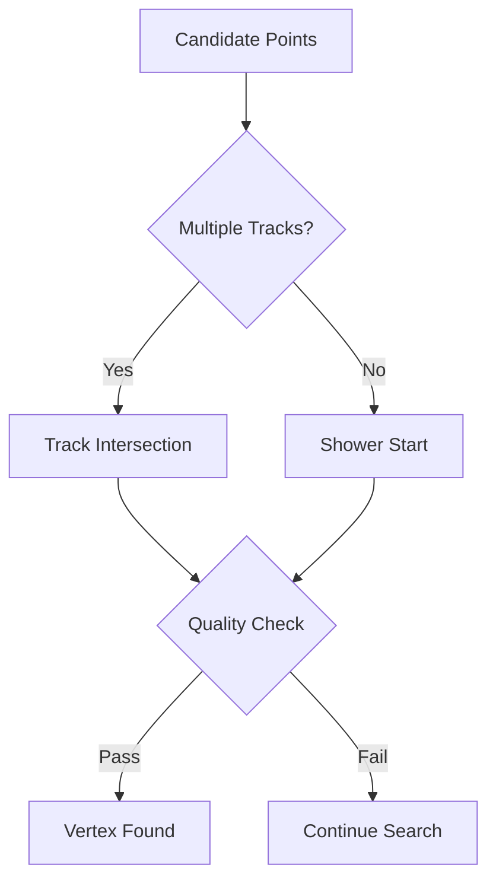

### 6. Output Generation System

#### Data Structure Organization
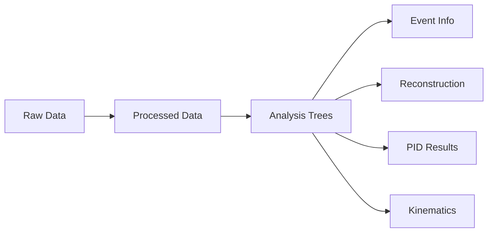

#### Quality Monitoring
The program implements several quality checks:

```python
quality_metrics = {
    'cluster_quality': {
        'completeness': 'Hit collection efficiency',
        'purity': 'Hit association accuracy',
        'coherence': 'Spatial consistency'
    },
    'track_quality': {
        'straightness': 'Path linearity',
        'mip_consistency': 'dQ/dx profile',
        'containment': 'Fiducial volume check'
    },
    'shower_quality': {
        'profile_match': 'EM shower consistency',
        'conversion_distance': 'Distance to vertex',
        'containment': 'Energy containment'
    }
}
```

## Advanced Features

### 1. Dead Channel Handling
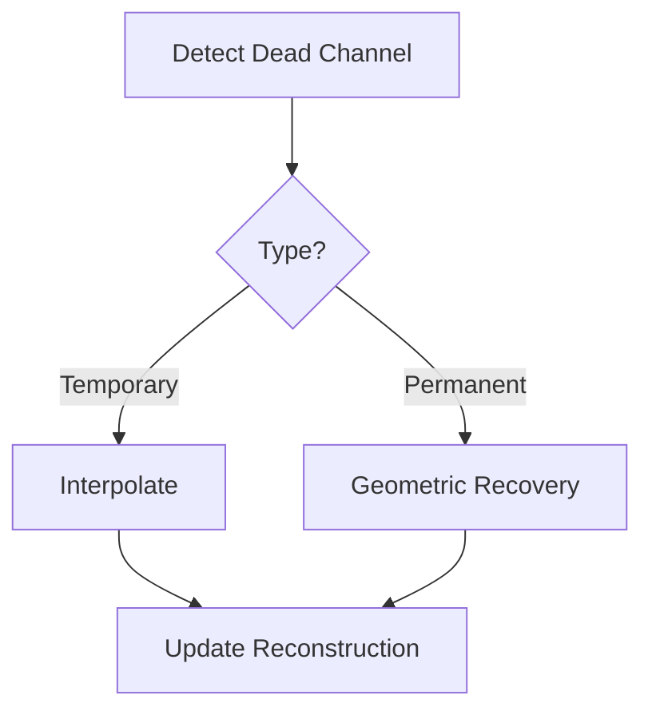

### 2. Noise Filtering
Implemented in multiple stages:
1. Coherent noise removal
2. Wire-by-wire filtering
3. Frequency domain filtering
4. ROI-based cleaning

### 3. Energy Reconstruction
Complex process involving:
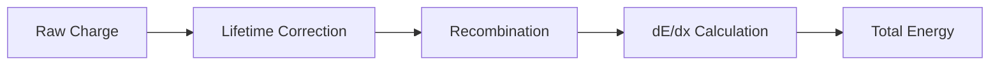

## Performance Optimizations

### 1. Memory Management
```python
def optimize_memory():
    """
    Key memory optimization strategies
    """
    # 1. Point cloud optimization
    implement_sparse_representation()
    use_dynamic_point_culling()
    
    # 2. Data structure optimization
    implement_lazy_loading()
    use_compressed_indices()
    
    # 3. Processing optimization
    batch_process_time_slices()
    parallelize_independent_operations()
```

### 2. Processing Efficiency
Several strategies employed:
1. Spatial indexing for fast neighbor finding
2. Optimized cluster merging algorithms
3. Efficient point cloud operations
4. Smart caching of intermediate results

## Error Handling and Recovery

### 1. Data Quality Checks
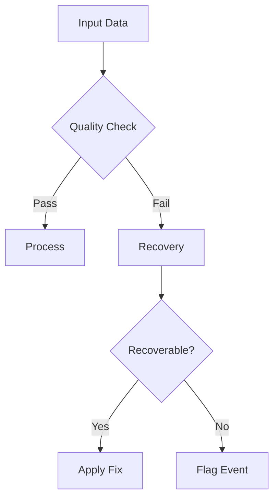

### 2. Recovery Strategies
System implements multiple recovery methods:
1. Geometric reconstruction for missing data
2. Interpolation for temporary issues
3. Pattern-based recovery for partial data
4. Alternative reconstruction paths

## Conclusion

The wire-cell-prod-nue program represents a sophisticated implementation of neutrino event reconstruction, combining multiple advanced algorithms and techniques. Its modular architecture and comprehensive error handling make it robust and adaptable to different analysis needs.

Key strengths include:
1. Sophisticated 3D reconstruction
2. Advanced particle identification
3. Comprehensive error handling
4. Efficient processing of large datasets
5. Flexible output structure for varied analysis needs