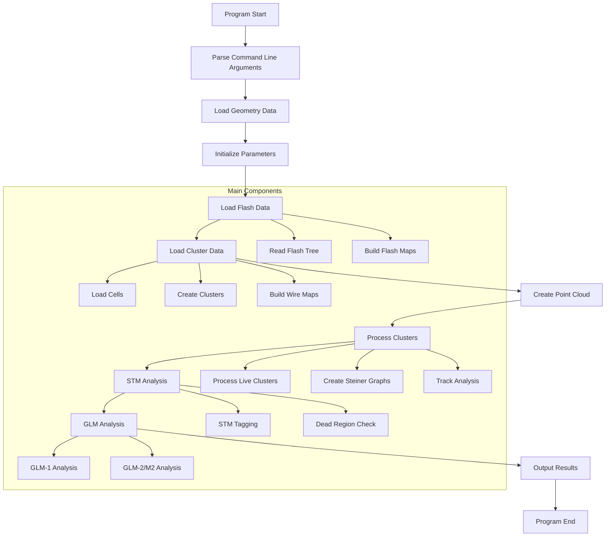

# Wire Cell STM Program Documentation

## Overview
The wire-cell-prod-stm program is a sophisticated particle tracking and reconstruction system designed for Time Projection Chamber (TPC) detectors. It implements space-time matching algorithms to reconstruct particle trajectories by combining information from multiple wire planes and optical detectors.

## Program Flow


## Detailed Component Analysis

### 1. Program Initialization and Configuration

#### Command Line Arguments
```cpp
bool flag_in_time_only = true;      // Run only in-time flash
bool flag_main_cluster_only = true;  // Run only on main cluster
bool flag_debug_output = true;       // Output debug info
int datatier = 0;                    // Data type (0=data, 1=overlay, 2=MC)
int flag_glm = 0;                   // GLM analysis type
```

The program accepts several configuration parameters that control its behavior:
- In-time flash processing
- Cluster selection
- Debug output generation
- Data tier specification
- GLM analysis configuration

### 2. Geometry and Parameter Setup

#### Wire Plane Configuration
```cpp
double pitch_u = gds.pitch(WirePlaneType_t(0));
double pitch_v = gds.pitch(WirePlaneType_t(1));
double pitch_w = gds.pitch(WirePlaneType_t(2));
double time_slice_width = nrebin * unit_dis * 0.5 * units::mm;
```

The program configures:
- Wire plane geometries (U, V, W planes)
- Wire pitches and angles
- Time slice parameters
- Detector boundaries

### 3. Flash Data Processing System

#### Flash Data Structure
```cpp
std::map<int, Opflash*> map_flash_info;
std::map<int, int> map_flash_tpc_ids;
std::map<int, int> map_tpc_flash_ids;
```

The flash processing system:
1. Reads optical detector data
2. Creates flash objects containing:
   - Timing information
   - PE (PhotoElectron) measurements
   - Channel information
3. Builds association maps between:
   - Flash IDs and TPC clusters
   - TPC clusters and flash information

### 4. Cluster Processing System

#### Cluster Creation
```cpp
for (int i=0; i!=cluster_id_vec->size(); i++) {
    SlimMergeGeomCell *mcell = new SlimMergeGeomCell(ident);
    mcell->SetTimeSlice(time_slice);
    mcell->set_q(q_vec->at(i));
    // Add wires and charges
    cluster->AddCell(mcell, time_slice);
}
```

Key features:
1. Geometric cell creation
2. Time slice assignment
3. Charge measurement integration
4. Wire plane association
5. Dead channel handling

### 5. Point Cloud Generation

The point cloud system creates a 3D representation of the detector data:

1. Point Creation:
```cpp
ToyCTPointCloud ct_point_cloud(
    0, 2399,        // U plane channels
    2400, 4799,     // V plane channels
    4800, 8255,     // W plane channels
    offset_t,       // Time offset
    -first_u_dis/pitch_u,  // U offset
    -first_v_dis/pitch_v,  // V offset
    -first_w_dis/pitch_w   // W offset
);
```

2. Data Integration:
- Incorporates charge measurements
- Handles dead channels
- Creates spatial indices

### 6. STM (Space-Time Match) Algorithm

The STM algorithm performs space-time matching between TPC clusters and optical flashes:

```cpp
bool check_stm(PR3DCluster* main_cluster,
               vector<PR3DCluster*>& additional_clusters,
               double offset_x,
               double flash_time,
               ToyCTPointCloud& ct_point_cloud,
               map<int,map<const GeomWire*, SMGCSelection>>& global_wc_map,
               int& event_type)
```

Algorithm steps:
1. Flash-Cluster Association
   - Temporal matching
   - Spatial correlation
2. Quality Assessment
   - Charge compatibility
   - Geometric consistency
3. Background Rejection
   - Cosmic ray identification
   - Noise filtering

### 7. GLM (Geometric Light Match) Analysis

The GLM system provides two analysis methods:

#### GLM-1 Analysis
```cpp
if (flag_glm == 1 || flag_glm == 3) {
    // Geometric light mismatch tagger
    auto glm_results = fid->glm_tagger(
        eventTime, flashes, main_cluster,
        additional_clusters, flash_info...
    );
}
```

#### GLM-2/M2 Analysis
```cpp
if (flag_glm == 2 || flag_glm == 3) {
    if (user_tgm == 0 && user_stm == 0) {
        auto M2_results = fid->M2_cosmic_tagger(
            eventTime, flashes, main_cluster,
            additional_clusters...
        );
    }
}
```

### 8. Output Generation

The program generates several ROOT trees containing analysis results:

1. T_match
   - Flash-cluster matching information
   - Event type classifications
   - Quality metrics

2. T_cluster
   - Cluster point information
   - Charge measurements
   - Spatial coordinates

3. T_rec
   - Reconstruction parameters
   - Track information
   - Quality measurements

4. T_proj
   - Projection data
   - Channel information
   - Time slice data

5. T_eval
   - Evaluation metrics
   - Truth matching (for MC)
   - Performance statistics

## Key Algorithms

### 1. Cluster Formation Algorithm
```cpp
// Pseudocode
for each time_slice:
    for each wire_plane (U,V,W):
        identify_connected_hits()
        form_2D_clusters()
    merge_2D_clusters_to_3D()
    add_to_global_cluster_collection()
```

### 2. Track Reconstruction
```cpp
// Pseudocode
for each cluster:
    create_steiner_graph()
    find_boundary_points()
    compute_shortest_paths()
    collect_charge_trajectory()
    perform_track_fitting()
```

### 3. Flash Matching Algorithm
```cpp
// Pseudocode
for each flash:
    for each cluster:
        compute_time_compatibility()
        check_spatial_correlation()
        calculate_charge_compatibility()
        if (matches_criteria):
            record_association()
```

## Performance Considerations

1. Speed Optimizations:
   - KD-tree for spatial searches
   - Efficient map structures
   - Parallel processing capabilities

2. Memory Management:
   - Smart pointer usage
   - Efficient data structures
   - Resource cleanup

3. Quality Checks:
   - Dead channel handling
   - Noise filtering
   - Background rejection

## Usage Examples

Basic usage:
```bash
wire-cell-uboone /path/to/ChannelWireGeometry.txt /path/to/matching.root #entry -t1 -c1 -o1
```

Options:
- `-t`: In-time flash only (0/1)
- `-c`: Main cluster only (0/1)
- `-o`: Debug output (0/1)
- `-g`: GLM analysis type (0-3)
- `-d`: Data tier (0-2)

## Conclusion

The wire-cell-prod-stm program implements a sophisticated system for particle tracking and reconstruction in TPC detectors. Its modular design and comprehensive analysis capabilities make it a powerful tool for particle physics research, combining multiple detection technologies and advanced algorithms for optimal results.